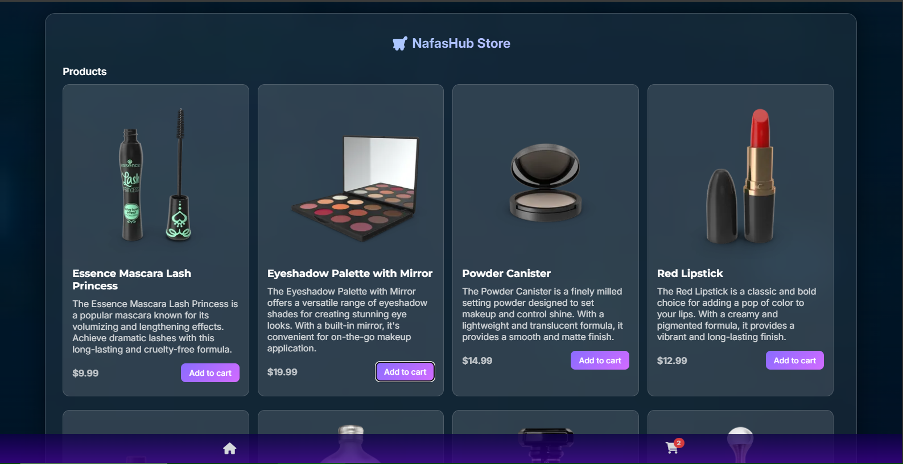

🛒 eCommerce Web Application

A modern, fully responsive multi-page eCommerce web application built with HTML, CSS, and Vanilla JavaScript, featuring real API data fetching, persistent cart storage, smooth animations, and a complete checkout flow.

Frontend Project by NafasHub

<p> 
  <a href="https://faaiz1505.github.io/eCommerce-cart-page/">🌐 Live Demo</a> • 
  <a href="#-features">Features</a> • 
  <a href="#-pages">Pages</a> • 
  <a href="#-technologies-used">Tech Stack</a> • 
  <a href="#-future-improvements">Future Improvements</a> 
</p>
<br/>

## 🔥 Overview  
This project is a frontend-focused eCommerce application that simulates a real online shopping experience.
It fetches live product data from an external API, allows users to browse products, manage their cart, and complete a checkout flow — all with persistent state using localStorage.

The application is structured across multiple pages with smooth animations, responsive layouts, and clean UI/UX design.

---

## ✨ Features  
- 📱 Fully responsive (mobile, tablet, desktop)  
- 🔄 Fetches real product data from an external API
- 📦 Dynamic product rendering
- 📄 Dedicated product listing page  
- 🔍 Individual product handling

---

## 🛒 Cart Functionality
- ➕ Add products to cart
- ➖ Increase / decrease quantity
- 🗑️ Remove items from cart
- 💰 Real-time price calculation
- 💾 Cart data stored in localStorage
- 🔁 Cart state persists on page reload 

---

## 🧾 Checkout & Summary
- 🧾 Dedicated checkout page
- 📋 Order summary page
- 🧮 Automatic subtotal and total calculations
- ✅ Seamless navigation between cart and checkout

---

## 🎨 UI / UX
- 📱 Fully responsive (mobile, tablet, desktop)
- 🎞️ Smooth animations and transitions
- 🎨 Clean, modern interface
- ⚡ Fast interactions without page reloads

---

## 📄 Pages
- 🏠 Home / Products Page – Displays products fetched from API
- 📦 Product Page – Individual product details
- 🛒 Cart Page – Manage cart items and quantities
- 🧾 Checkout Page – Review order and proceed
- 📋 Summary Page – Order summary and confirmation

---

## 🛠 Technologies Used  
| Technology               | Purpose                                      |
| ------------------------ | -------------------------------------------- |
| **HTML5**                | Page structure & semantics                   |
| **CSS3**                 | Styling, animations, Flexbox, responsiveness |
| **JavaScript (Vanilla)** | API handling, cart logic, DOM manipulation   |
| **Fetch API**            | Retrieve live product data                   |
| **LocalStorage**         | Persistent cart data                         |

---

## 📸 Screenshots  
Here’s a preview of the application interface::


---

## 📂 Folder Structure  
     ```bash
    /eCommerce-cart-page
    │── index.html
    │── products.html
    │── cart.html
    │── checkout.html
    │── summary.html
    │── style.css
    │── script.js
    │── /images
    │── /screenshots
    └── README.md

---

## 🎯 Purpose of the Project  
This project was built to: 
- Practice real-world eCommerce frontend logic
- Work with external APIs
- Responsive web layouts  
- Implement persistent application state
- Improve UI/UX and animations
- Structure a multi-page frontend project
- Strengthen JavaScript problem-solving skills

It also serves as a strong portfolio project demonstrating practical frontend development skills.

---

## 🚀 Future Improvements  
- 🔐 User authentication (login / signup)
- 💳 Payment gateway integration
- 🧾 Order history page
- 🌙 Dark mode support
- 🔍 Search and product filtering
- 🧪 Unit testing for cart logic 

---

## 🤝 Contributing  
Contributions are welcome!
If you want to:
- Improve UI/UX
- Add features
- Optimize performance
- Refactor code structure

Feel free to fork the repository and submit a pull request

---

## 👨‍💻 Author  
**NafasHub**  
Frontend Developer | Designer  
🔗 GitHub: https://github.com/faaiz1505  
Email: nasirudeenfaaiz755@gmail.com
Whatsapp: [Chat with me->](https://wa.me/2348012345678?text=Hello!)


